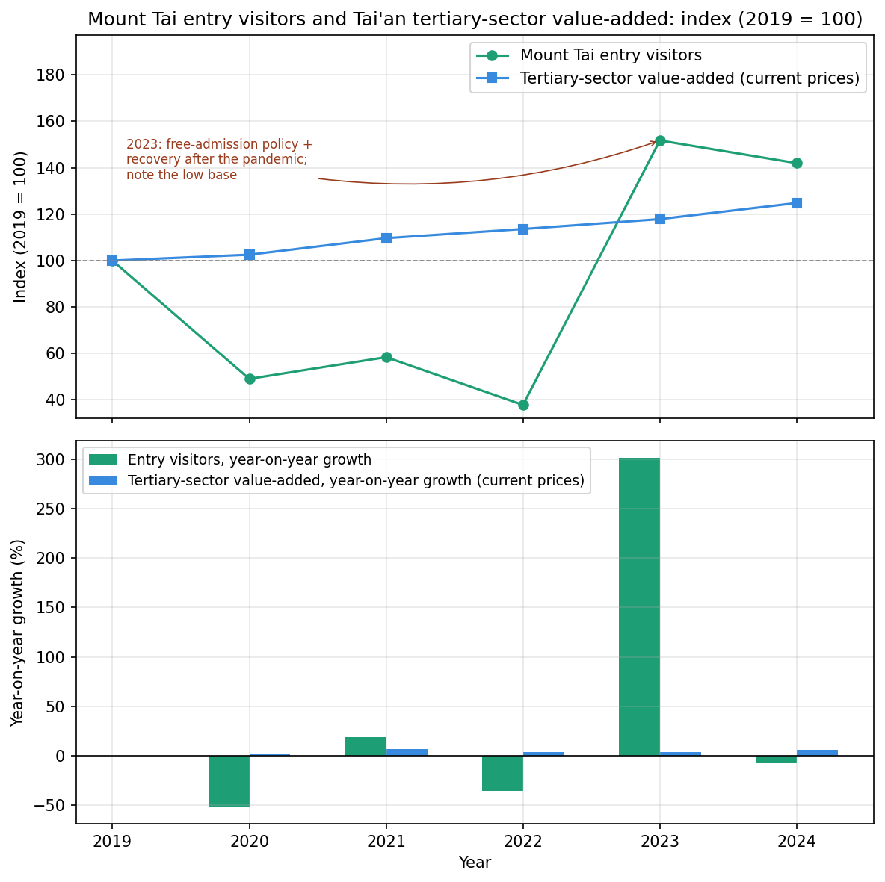
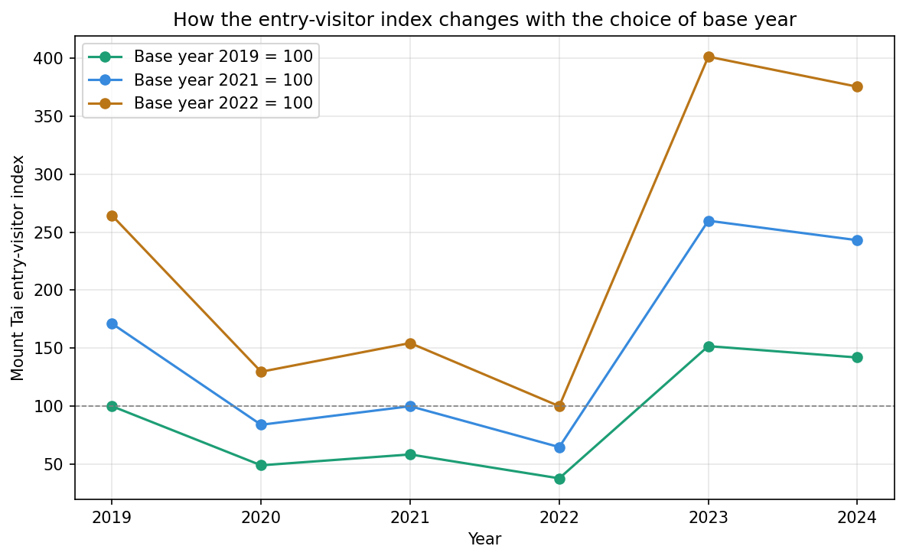

# Do Mount Tai Visitor Numbers and Tai'an's Service Economy Move Together?
## — Observations from 2019–2024 Data

*This is the English version, translated from the Chinese original ([research_report_zh.md](research_report_zh.md)). If the two differ, the Chinese version is the reference, because it is the author's own wording. Both versions use the same data; the figures in this version have English labels.*

## Abstract

Living at the foot of Mount Tai, I often see how crowded the scenic area gets during holidays. This made me wonder: when visitor numbers rise, does Tai'an's service-sector economy show a similar increase? This report compares Mount Tai's annual entry-visitor numbers with Tai'an's tertiary-sector value-added from 2019 to 2024, indexing both to 2019 as a base year. The results show that visitor numbers fluctuated considerably over these six years, while tertiary-sector value-added rose relatively steadily — the two do not move in full sync. In particular, 2023 visitor numbers rose about 301.3% compared with 2022, but only about 51.8% compared with 2019, which shows that growth rates must be read together with the year they are compared against. Because this report compares a single scenic area's visitor flow with city-wide service-sector output, and relies on only six years of annual data, these results can only describe a trend — they cannot be used to judge Mount Tai tourism's specific contribution to the local economy.

## 1. Why I chose this question

I have lived at the foot of Mount Tai for many years, and I am familiar with the long queues at the main gate and the cable car stations on weekends and short holidays. But when I listened to older relatives talking about income, another question came to mind: with the scenic area so busy, are local residents' incomes also rising at the same pace?

This question comes from everyday observation, so it cannot be treated as a fact. To answer it directly, I would need to know which residents work in tourism-related jobs, how their income has changed, and where visitors' money is actually spent. The data I have cannot support that kind of analysis. So I narrowed the question to one that existing data can address: **from 2019 to 2024, is the trend in the number of visitors entering the Mount Tai scenic area in sync with the trend in the value-added of Tai'an's tertiary sector?**

I chose the number of entry visitors because it is closest to the Mount Tai visitor flow that I originally cared about. The city-wide visitor count also includes other attractions and tourism activities, so it cannot stand in for Mount Tai. Tertiary-sector value-added lets me look at the service economy of the whole city, but it also includes sectors such as finance that have no direct link to visitor flow at the scenic area. So comparing these two indicators helps me see how they trend, but it cannot directly answer whether residents earn more because of tourism.

## 2. Data and methods

### 2.1 What data I used

This report uses two core data series for 2019–2024: the number of visitors entering the Mount Tai scenic area, and the value-added of Tai'an's tertiary sector. The visitor data come from annual statistical bulletins, a special-purpose bond feasibility report, credit-rating reports and similar sources; the tertiary-sector value-added comes from the Tai'an Statistical Yearbook. The source and definition for each year are recorded in the accompanying data dictionary (in Chinese).

I only use data from 2019 to 2024. In the 2016–2018 bulletins the wording is "visitors received" (接待游客), which differs from the wording "visitors entering the mountain and scenic sites" (进山进景点游客) used from 2019 on. The 2018 figure roughly matches the "entering the mountain and scenic sites" figure (5.62 million visits) in a special-purpose bond feasibility report, but the 2024 bulletin also gives two figures with different scopes (9.4109 million "visitors received" and 8.0629 million "visitors entering Mount Tai"). To be careful, I therefore use only data from 2019 onward, where the definition is relatively consistent. The 2025 figures are still preliminary and the statistical yearbook has not been published yet, so I do not use them for now.

By "entry visitors" I mean the figure called "visitors entering the mountain and scenic sites" in statistical bulletins and similar sources. The exact wording differs slightly from year to year (for example "visitors entering Mount Tai" or "entry visitors"). I use this narrower figure and do not use the broader "visitors received" figure.

My visitor data come from several kinds of sources, and for the same year I sometimes found different numbers. My approach was this: where the statistical yearbook has the data, I use the formal numbered tables of the yearbook first; where the yearbook does not have it — as with entry visitors — I use the statistical bulletins and cross-check them against the special-purpose bond feasibility report, the credit-rating reports and materials from the scenic area management committee; numbers that do not match and whose original text I could not verify are not used. For example, for 2023 I came across a figure of 10.0942 million visits, but a rating report says that the 2024 figure (8.0629 million visits) was "a slight decrease from the previous year". If 2023 had really been 10.0942 million, 2024 would be about 20% lower, which is not a slight decrease, so I did not use that figure and used 8.6197 million instead.

Visitor numbers are counted in "visits" (人次), so the same person entering the mountain several times may be counted several times. Tertiary-sector value-added is at current prices, so its changes may reflect both changes in the scale of economic activity and changes in prices; they should not be read directly as real growth with price effects removed.

### 2.2 How I compare two different indicators

The two indicators have different units, so comparing their sizes directly makes no sense. I set both indicators to 100 in 2019 and calculated an index for each later year:

> Index for a year = value in that year ÷ value in 2019 × 100

For example, an index of 120 means the indicator is 20% higher than in 2019. This lets me compare how each indicator has changed relative to its own starting point, but it does not remove the difference in what the two indicators cover.

I also compared year-on-year growth rates, and calculated the visitor index with 2019, 2021 and 2022 as the base year, to see how much the numbers change when the comparison year changes.

This report has only six annual observations, and they include the unusual changes during the pandemic. Running a regression on such data would hardly give a stable or reliable explanation, so I mainly describe the data with charts and growth rates, and I do not run significance tests or causal analysis.

The calculations and charts were done in Python (pandas, matplotlib); the scripts are in the repository's `scripts` folder.

## 3. What the data show

### 3.1 Visitor numbers fluctuate widely, while service-sector value-added grows more steadily

Taking 2019 as 100, the index and year-on-year change of entry visitors at Mount Tai are shown in Table 1, and a comparison of the two indicators is shown in Figure 1.

**Table 1　Index and year-on-year growth rate of Mount Tai entry visitors (2019 = 100)**

| Year | Visitor index (2019 = 100) | Year-on-year growth |
| --- | ---: | ---: |
| 2019 | 100.0 | — |
| 2020 | 49.1 | −50.9% |
| 2021 | 58.4 | 19.1% |
| 2022 | 37.8 | −35.2% |
| 2023 | 151.8 | 301.3% |
| 2024 | 142.0 | −6.5% |

Note: The index and growth figures are carried over from the earlier analysis and are rounded; recalculating the growth rates from the rounded indices in the table may give small differences.

**Figure 1　Index of Mount Tai entry visitors and Tai'an tertiary-sector value-added, and year-on-year growth rates (2019 = 100)**

In 2020 the number of visitors dropped to about half of the 2019 level. It recovered somewhat in 2021, but in 2022 it fell again to the lowest point of the six years. In 2023 it rose clearly and exceeded the 2019 level; in 2024 it fell back, but was still about 42.0% higher than in 2019.

The value-added of the tertiary sector changed much more gently. Its index rose from 100 in 2019 to 124.8 in 2024, growing in every year; compared with the previous year, the annual increases were about 2.5% to 7.0%.

The two indicators differ not only in the size of their changes but, in some years, also in direction. In 2020 and 2022 visitor numbers fell while tertiary-sector value-added kept rising; the same happened in 2024. In 2021 and 2023 both indicators grew, but visitor numbers grew by more. So in these six years of annual data, the two do not show a sustained, synchronized movement.

This does not mean that visitor numbers and the local economy are unrelated. The tertiary sector covers many industries, and even if hotels, restaurants and similar industries are affected by visitor flow, the effect may not show up with the same size in city-wide figures. The available data cannot separate the changes in individual industries, nor tell whether the effect of visitor flow shows up with a delay.

### 3.2 "Up 301.3%" needs to say which year it is compared with

In 2023 the number of visitors entering Mount Tai was 8.6197 million visits, against 2.148 million in 2022, an increase of about 301.3%. This figure stands out, but 2022 happens to be the lowest point in the period.

If I compare with 2019 (5.679 million visits) instead, the 2023 increase is about 51.8%. Both results are valid; they just answer different questions: 301.3% describes how much visitor numbers rebounded from the low in 2022, and 51.8% describes how far they were above the pre-pandemic level.

This is a point that I think the analysis must make clear. If I simply wrote "visitors more than tripled", readers could easily overlook the starting point. A more accurate statement is: **in 2023 visitor numbers were about 301.3% higher than in 2022 and about 51.8% higher than in 2019.**

When the base year is set to 2019, 2021 and 2022 in turn, the ups and downs of the visitor curve do not change in order, but the 2023 index ranges from 151.8 to 401.3 (see Figure 2). Changing the base year only changes the scale of the display; it provides no new observations, so the three curves cannot be treated as three independent checks.

**Figure 2　Index of Mount Tai entry visitors with 2019, 2021 and 2022 as the base year**

### 3.3 How to understand the changes during and after the pandemic

From 2020 to 2022 the number of visitors was below the 2019 level, and in 2023 it rose clearly. In terms of timing, this fits the background of travel being disrupted during the pandemic and gradually recovering afterwards. In addition, according to the departmental budget of the Mount Tai scenic area management committee, the scenic area ran a free-admission policy from 21 January to 31 March 2023.

However, annual data merge a whole year into a single number. They cannot tell us in which months visitor numbers began to rise, nor separate how much was due to the recovery of travel and how much to scenic-area policies. The high growth rate in 2023 was also affected by the low base in 2022. So this report treats these factors only as background for understanding the data, and does not judge the effect of any policy.

## 4. A supplementary observation on residents' income

Although the core analysis does not directly answer the question about residents' income, I kept one set of figures that I found while organizing the data, because it is related to my original question.

From 2019 to 2024, the ratio of urban to rural residents' per-capita disposable income in Tai'an fell from 2.02 to 1.82; over the same period, the absolute gap between the two rose from 19,074 yuan to 21,625 yuan, an increase of about 13.4%. In other words, the relative gap narrowed, but the gap in money terms kept widening.

These two changes do not contradict each other. Rural residents started from a lower income, so even with faster percentage growth, the amount added each year can be smaller than for urban residents. So the question "has the urban–rural income gap narrowed?" needs to say which measure is being used. A falling ratio alone cannot describe all the changes in the income gap, and it certainly cannot be attributed to tourism.

In addition, the city-wide revenue per domestic visit in the existing data (domestic tourism revenue divided by the number of domestic tourist visits) stayed roughly between 900 and 1,100 yuan from 2019 to 2024, with no clear sustained rise or fall. This average cannot represent what visitors to Mount Tai actually spend, nor does it show how much of this revenue ends up in local households. Since the definitions for some years have not been confirmed, this report does not draw further conclusions from it.

## 5. Limitations of this study

The biggest problem is that the visitor flow of a single scenic area and the value-added of the whole city's service sector are not fully corresponding indicators. Indexing makes them easier to look at together, but it does not solve the problem of their different coverage. With more detailed data for hotels, restaurants and similar industries, the comparison would be closer to the research question.

The time range is also a problem. Six years of data are not enough to show a long-term relationship, and the unusual swings during the pandemic make up a large part of them. So the trend seen in this period may not represent other years.

The data themselves also need further checking. The visitor data are scattered across different kinds of documents, and later citations will still need specific sources and page numbers. The city-wide domestic tourism revenue is explicitly defined as excluding inbound visitors and their spending in 2022–2024, but it is not yet known whether 2019–2021 use the same definition. In addition, total ticket revenue for the Mount Tai scenic area is missing for 2023, and the two estimates back-calculated from different sources in the earlier work do not agree, so I did not use either estimate.

## 6. Conclusion and next steps

Going back to the original question: from 2019 to 2024, the number of visitors at Mount Tai and the value-added of Tai'an's tertiary sector did not keep changing in sync. Visitor numbers went through a large fall and rebound, while the city's service-sector value-added grew relatively steadily. But this comparison cannot yet answer how much income tourism brought to local residents.

For me, the most valuable thing about this analysis was finding that "a busy scenic area", "growth in the service sector" and "higher incomes for residents" are linked in some way, but each needs different data to answer. A question that began in everyday life cannot be settled by two annual curves alone.

Next, I hope to add monthly or quarterly visitor data to see when the changes happened, and to compare them with records of policy implementation. If I can get data for hotels and restaurants, or collect income information from local shops and workers, I could go on to discuss the link between more visitors and local business and employment. Before that, I still need to fill in page numbers for the sources of the existing data and confirm the definitions used in different years. The specific directions and priorities are in `docs/future_directions.md` (in Chinese).

## Appendix: Supporting materials

The supporting documents below are written in Chinese; the README is bilingual.

- Data dictionary: `docs/data_dictionary.md`
- Data verification record: `docs/data_priority_policy.md`
- Data conflict list: `data/data_conflict_audit.csv`
- Methods notes: `docs/methodology_notes.md`
- Main comparison notes: `analysis/core_comparison_analysis.md`
- Base-year comparison notes: `analysis/sensitivity_analysis.md`
- Supplementary analysis notes: `analysis/supplementary_analysis_notes.md`
- Future research directions: `docs/future_directions.md`
- Figures: `analysis/figures/01_core_comparison_en.png` and `analysis/figures/02_sensitivity_base_year_en.png` (English labels); the Chinese-labelled versions are `01_core_comparison_python.png` and `02_sensitivity_base_year.png`
- Calculation scripts: `scripts/plot_core_comparison.py`, `scripts/sensitivity_check.py`, `scripts/supplementary_analysis.py` and their `.ipynb` versions; `scripts/make_english_figures.py` produces the English-labelled figures

**Note on writing assistance:** The first draft of the Chinese report was written by AI. I rewrote the wording throughout and checked the numbers; the unit of the visitor numbers (10,000 visits) was corrected after I checked the original data with AI; the parts about my own experience were written entirely by me. The additional notes in section 2.1 on data scope and the choice of sources were drafted by AI from the data verification records. This English version was translated from the Chinese version by AI; if the two differ, the Chinese version is the reference. AI assistance is not a data source.
